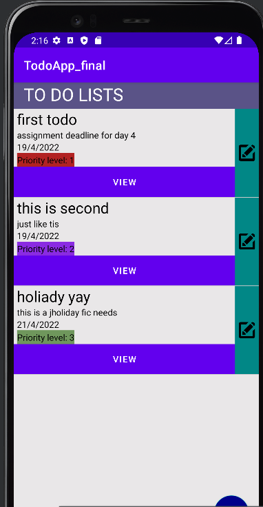
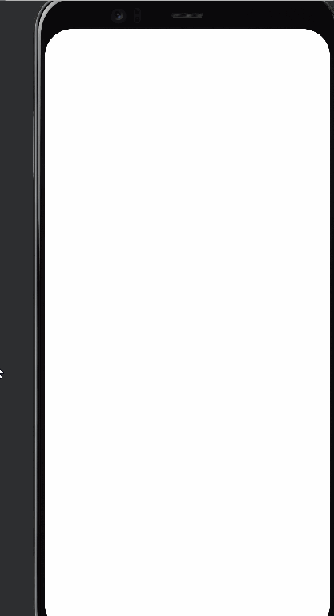
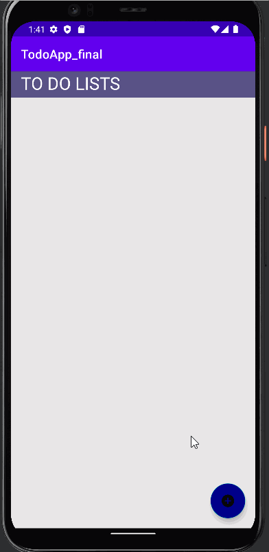
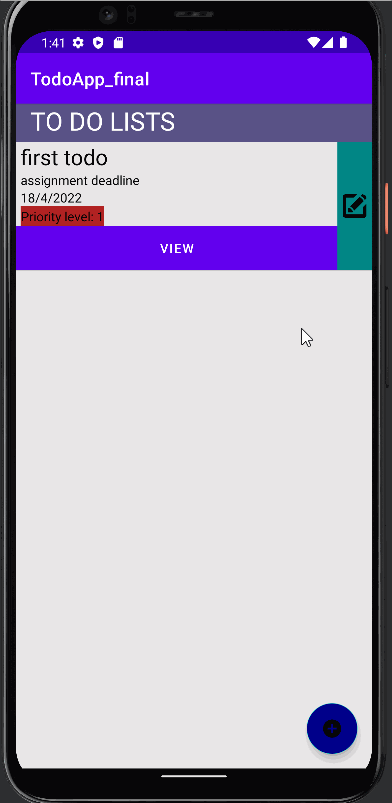
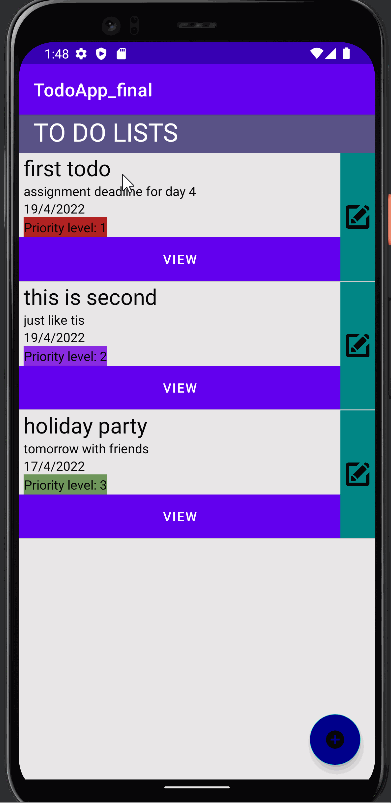
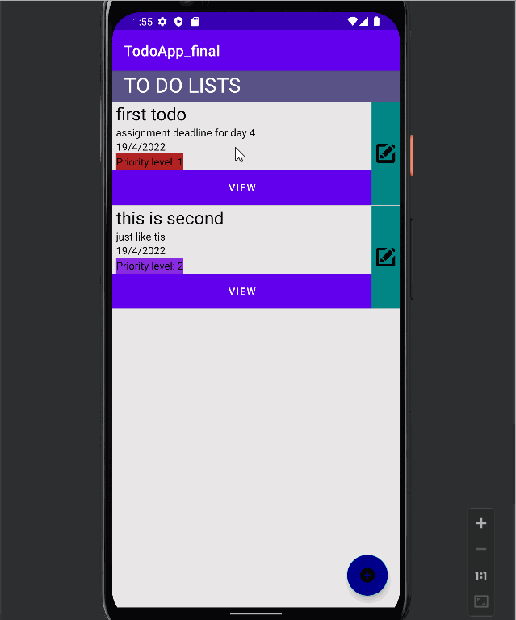

# ToDoApp

##HomePage

The front page of our Todo App

##Splash screen

##Add Tasks

The user will be able to easily add to do daily tasks 

##Edit/Update Tasks

The user will be able to edit/update the tasks 

##delete Tasks

The user will be able to delete the to do tasks

##AHorizontal view

The app can be viewed in horizontol and vertical way

